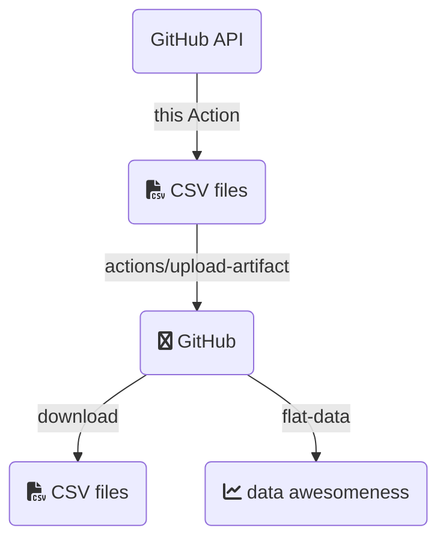

# GitHub Advanced Security to CSV

Simple GitHub Action to scrape the GitHub Advanced Security API and shove it into a CSV.  

## Why?

Because I really want to see this data for a repository as a time-series to understand it, and [Flat Data](https://next.github.com/projects/flat-data/) doesn't support paginated APIs (yet?) ... so ... it's really an experiment and I wanted to play around with the shiny new toy.

Also ... CSV files are the dead-simple ingest point for a ton of other software services you might ~~want~~ have to use in business.  And some people just like CSV files and want to do things in spreadsheets and I'm not here to judge that.  Shine on, you spreadsheet gurus! :sparkles:

## How

This got a little more complicated than I'd like, but the tl;dr of what I'm trying to figure out is below:



Obviously if you're only wanting the CSV file, run this thing, then download the artifact.  It's a zip file with the CSV file(s).  You're ready to rock and roll. :)

An example of use is below.  Note that the custom inputs, such as if you are wanting data on a different repo and need additional scopes for that, are set as environmental variables:

```yaml
      - name: CSV export
        uses: some-natalie/ghas-to-csv@v0.1.1
        env:
          GITHUB_PAT: ${{ secrets.PAT }}  # if you need to set a custom PAT
      - name: Upload CSV
        uses: actions/upload-artifact@v3
        with:
          name: ghas-data
          path: ${{ github.workspace }}/*.csv
          if-no-files-found: error
```

## But it doesn't do THIS THING

The API docs are [here](https://docs.github.com/en/enterprise-cloud@latest) and pull requests are welcome! :heart:

## Using this with Flat Data

Why?  Because look at this beatiful [viewer](https://flatgithub.com).  It's so nice to have a working time-series data set without a ton of drama.


This gets a little tricky because Flat doesn't support scraping paginated APIs or importing from a local file, so here's an example workflow that loads the data through a GitHub Actions runner.

```yaml
name: Gather data for Flat Data
on:
  schedule:
    - cron: '30 22 * * 1'  # Weekly at 22:30 UTC on Mondays
jobs:
  data_gathering:
    runs-on: ubuntu-latest
    steps:
      - name: Check out repo
        uses: actions/checkout@v3
      - name: CSV export
        uses: some-natalie/ghas-to-csv@v0.1.1
        env:
          GITHUB_PAT: ${{ secrets.PAT }}  # needed if not running against the current repository
          SCOPE_NAME: "OWNER-NAME/REPO-NAME"  # repository name, needed only if not running against the current repository
      - name: Upload CSV
        uses: actions/upload-artifact@v3
        with:
          name: ghas-data
          path: ${{ github.workspace }}/*.csv
          if-no-files-found: error
  flat_data:
    runs-on: ubuntu-latest
    needs: [data_gathering]
    steps:
      - name: Check out repo
        uses: actions/checkout@v3
      - name: Download CSVs
        uses: actions/download-artifact@v3
        with:
          name: ghas-data
      - name: Tiny http server moment  # Flat can only use HTTP or SQL, so ... yeah.
        run: |
          docker run -d -p 8000:80 --read-only -v $(pwd)/nginx-cache:/var/cache/nginx -v $(pwd)/nginx-pid:/var/run -v $(pwd):/usr/share/nginx/html:ro nginx
          sleep 10
      - name: Flat the code scanning alerts
        uses: githubocto/flat@v3
        with:
          http_url: http://localhost:8000/cs_list.csv
          downloaded_filename: cs_list.csv
      - name: Flat the secret scanning alerts
        uses: githubocto/flat@v3
        with:
          http_url: http://localhost:8000/secrets_list.csv
          downloaded_filename: secrets_list.csv
```

:information_source:  You may want to append what's below to the repository's `.gitignore` file to ignore the pid directory created by nginx.

```gitignore
nginx-pid/
```
