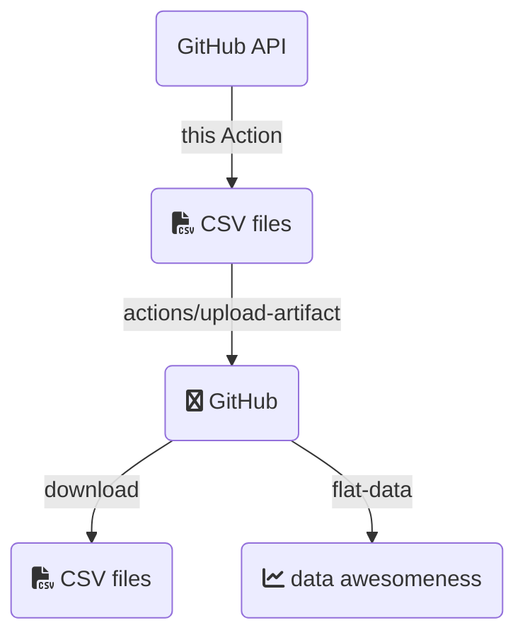
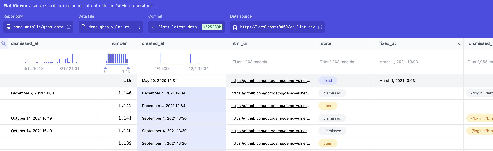

# GitHub Advanced Security to CSV

Simple GitHub Action to scrape the GitHub Advanced Security API and shove it into a CSV.

> **Note**
>
> You need to set and store a PAT because the built-in `GITHUB_TOKEN` doesn't have the appropriate permissions for this Action to get all of the alerts.

## What?

GitHub Advanced Security can compile a _ton_ of information on the vulnerabilities in your project's [code](https://github.com/features/security/code), [supply chain](https://github.com/features/security/software-supply-chain), and any [secrets](https://docs.github.com/en/enterprise-cloud@latest/code-security/secret-scanning/about-secret-scanning) (like API keys or other sensitive info) that might have been accidentally exposed.  That information is surfaced in the repository, organization, or enterprise [security overview](https://docs.github.com/en/enterprise-cloud@latest/code-security/security-overview/about-the-security-overview) and the API.  The overview has all sorts of neat filters and such you can play with.  The API is great and powers all manner of partner integrations, but there's no direct CSV export.

The API changes a bit based on the version of GitHub you're using.  This Action gathers the GitHub API endpoint to use from the runner's [environment variables](https://docs.github.com/en/enterprise-cloud@latest/actions/learn-github-actions/environment-variables#default-environment-variables), so as long as you have a license for Advanced Security, this should work as expected in GitHub Enterprise Server and GitHub AE too.

## Why?

Because I really want to see this data as a time-series to understand it, and [Flat Data](https://next.github.com/projects/flat-data/) doesn't support paginated APIs (yet?) ... so ... it's really an experiment and I wanted to play around with the shiny new toy.

Also ... CSV files are the dead-simple ingest point for a ton of other software services you might ~~want~~ have to use in business.  And some people just like CSV files and want to do things in spreadsheets and I'm not here to judge that.  Shine on, you spreadsheet gurus! :sparkles:

## How?

This got a little more complicated than I'd like, but the tl;dr of what I'm trying to figure out is below:



Obviously if you're only wanting the CSV file, run this thing, then download the artifact.  It's a zip file with the CSV file(s).  You're ready to rock and roll. :smile:

An example of use is below.  Note that the custom inputs, such as if you are wanting data on a different repo and need additional scopes for that, are set as environmental variables:

```yaml
      - name: CSV export
        uses: advanced-security/ghas-to-csv@v2
        env:
          GITHUB_PAT: ${{ secrets.PAT }}  # you need to set a PAT
      - name: Upload CSV
        uses: actions/upload-artifact@v3
        with:
          name: ghas-data
          path: ${{ github.workspace }}/*.csv
          if-no-files-found: error
```

To run this targeting an organization, here's an example:

```yaml
      - name: CSV export
        uses: advanced-security/ghas-to-csv@v2
        env:
          GITHUB_PAT: ${{ secrets.PAT }}
          GITHUB_REPORT_SCOPE: "organization"
          SCOPE_NAME: "org-name-goes-here"
```

Or for an enterprise:

```yaml
      - name: CSV export
        uses: advanced-security/ghas-to-csv@v2
        env:
          GITHUB_PAT: ${{ secrets.PAT }}
          GITHUB_REPORT_SCOPE: "enterprise"
          SCOPE_NAME: "enterprise-slug-goes-here"
```

The list of all available options that can be set as environmental variables is below:

- `GITHUB_API_URL`: The URL of the GitHub API. Default value: `https://api.github.com`.
- `GITHUB_SERVER_URL`: The URL of the GitHub server. Default value: `https://github.com`.
- `GITHUB_PAT` or `GITHUB_TOKEN`: The personal access token (PAT) or token for authenticating with the GitHub API. If `GITHUB_PAT` is not set, the value of `GITHUB_TOKEN` is used if it is set. If neither is set, an error occurs.
- `GITHUB_REPORT_SCOPE`: The scope of the report to generate. Valid values are `repository` (default), `organization`  or `enterprise`.
- `SCOPE_NAME` or `GITHUB_REPOSITORY`: The name of the repository, organization or enterprise to generate the report for. If `SCOPE_NAME` is not set, the value of `GITHUB_REPOSITORY` is used if it is set. If neither is set, an error occurs.
- `FEATURES`: A comma-separated list of features to include in the report. Valid values are `codescanning`, `secretscanning`, `dependabot` or simply `all`. Default value: `all`.

The first two are only needed if you're running this in a GitHub Enterprise Server or GitHub AE environment.  The last one is useful if you only want to get data on a specific feature.  For example, if you only want to get data on secret scanning, you can set `FEATURES` to `secretscanning`. Here's just another example how you would configure this on a GitHub Enterprise Server:

```yaml
      - name: CSV export
        uses: advanced-security/ghas-to-csv@v2
        env:
          GITHUB_PAT: ${{ secrets.PAT }}
          GITHUB_API_URL: "https://github.example.com/api/v3"
          GITHUB_SERVER_URL: "https://github.example.com"
          GITHUB_REPORT_SCOPE: "enterprise"
          SCOPE_NAME: "enterprise-slug-goes-here"
          FEATURES: "secretscanning,codescanning"
```

## Reporting

|   | GitHub Enterprise Cloud | GitHub Enterprise Server (3.5+) | GitHub AE (M2) | Notes |
| --- | --- | --- | --- | --- |
| Secret scanning | :white_check_mark: Repo<br>:white_check_mark: Org<br>:white_check_mark: Enterprise |  :white_check_mark: Repo<br>:white_check_mark: Org<br>:white_check_mark: Enterprise | :white_check_mark: Repo<br>:x: Org<br>:x: Enterprise | [API docs](https://docs.github.com/en/enterprise-cloud@latest/rest/reference/secret-scanning) |
| Code scanning |  :white_check_mark: Repo<br>:white_check_mark: Org<br>:white_check_mark: Enterprise | :white_check_mark: Repo<br>:white_check_mark: Org<br>:curly_loop: Enterprise (3.5, 3.6) <br>:white_check_mark: Enterprise (3.7+) |  :white_check_mark: Repo<br>:x: Org<br>:curly_loop: Enterprise | [API docs](https://docs.github.com/en/enterprise-cloud@latest/rest/reference/code-scanning) |
| Dependabot | :white_check_mark: Repo<br>:white_check_mark: Org<br>:white_check_mark: Enterprise | :white_check_mark: Repo (3.8+)<br>:white_check_mark: Org (3.8+)<br>:white_check_mark: Enterprise (3.8+)  | :x: | [API docs](https://docs.github.com/en/enterprise-cloud@latest/rest/dependabot/alerts) |

:information_source:  All of this reporting requires either public repositories or a GitHub Advanced Security license.

:information_source:  Any item with a :curly_loop: needs some looping logic, since repositories are supported and not higher-level ownership (like orgs or enterprises).  How this looks won't differ much between GHAE or GHES.  In both cases, you'll need an enterprise admin PAT to access the `all_organizations.csv` or `all_repositories.csv` report from `stafftools/reports`, then looping over it in the appropriate scope.  That will tell you about the existence of everything, but not give you permission to access it.  To do that, you'll need to use `ghe-org-admin-promote` in GHES ([link](https://docs.github.com/en/enterprise-server@latest/admin/configuration/configuring-your-enterprise/command-line-utilities#ghe-org-admin-promote)) to own all organizations within the server.

## Using this with Flat Data

Why?  Because look at this beautiful [viewer](https://flatgithub.com).  It's so nice to have a working time-series data set without a ton of drama.



This gets a little tricky because Flat doesn't support scraping paginated APIs or importing from a local file, so here's an example workflow that loads the data through a GitHub Actions runner.

```yaml
name: Gather data for Flat Data
on:
  schedule:
    - cron: '30 22 * * 1'  # Weekly at 22:30 UTC on Mondays
jobs:
  data_gathering:
    runs-on: ubuntu-latest
    steps:
      - name: CSV export
        uses: advanced-security/ghas-to-csv@v2
        env:
          GITHUB_PAT: ${{ secrets.PAT }}  # needed if not running against the current repository
          SCOPE_NAME: "OWNER-NAME/REPO-NAME"  # repository name, needed only if not running against the current repository
      - name: Upload CSV
        uses: actions/upload-artifact@v3
        with:
          name: ghas-data
          path: ${{ github.workspace }}/*.csv
          if-no-files-found: error
  flat_data:
    runs-on: ubuntu-latest
    needs: [data_gathering]
    steps:
      - name: Check out repo
        uses: actions/checkout@v3
      - name: Download CSVs
        uses: actions/download-artifact@v3
        with:
          name: ghas-data
      - name: Tiny http server moment  # Flat can only use HTTP or SQL, so ... yeah.
        run: |
          docker run -d -p 8000:80 --read-only -v $(pwd)/nginx-cache:/var/cache/nginx -v $(pwd)/nginx-pid:/var/run -v $(pwd):/usr/share/nginx/html:ro nginx
          sleep 10
      - name: Flat the code scanning alerts
        uses: githubocto/flat@v3
        with:
          http_url: http://localhost:8000/cs_list.csv
          downloaded_filename: cs_list.csv
      - name: Flat the secret scanning alerts
        uses: githubocto/flat@v3
        with:
          http_url: http://localhost:8000/secrets_list.csv
          downloaded_filename: secrets_list.csv
```

:information_source:  You may want to append what's below to the repository's `.gitignore` file to ignore the pid directory created by nginx.

```gitignore
nginx-pid/
```

## But it doesn't do THIS THING

The API docs are [here](https://docs.github.com/en/enterprise-cloud@latest) and pull requests are welcome! :heart:. 
See [CONTRIBUTING](CONTRIBUTING.md) for more information.

## Other notes

[GitHub Copilot](https://copilot.github.com/) wrote most of the Python code in this project.  I mostly just structured the files/functions, wrote some docstrings, accounted for the differences in API versions across the products, and edited what it gave me. :heart:
